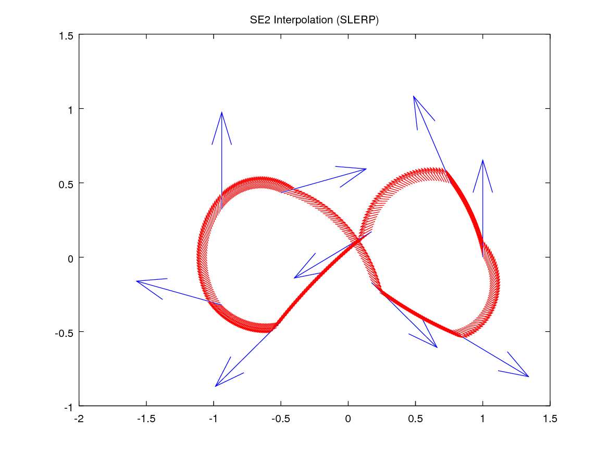
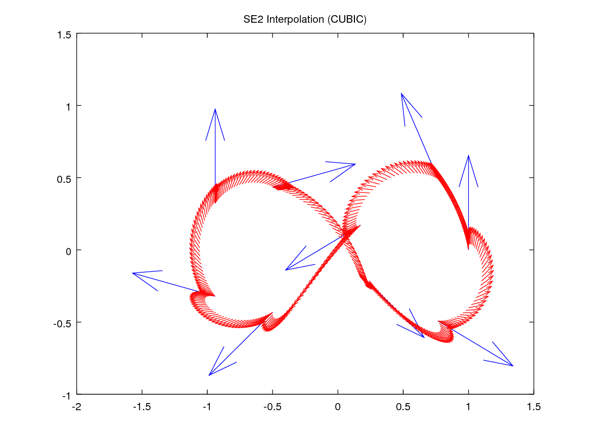
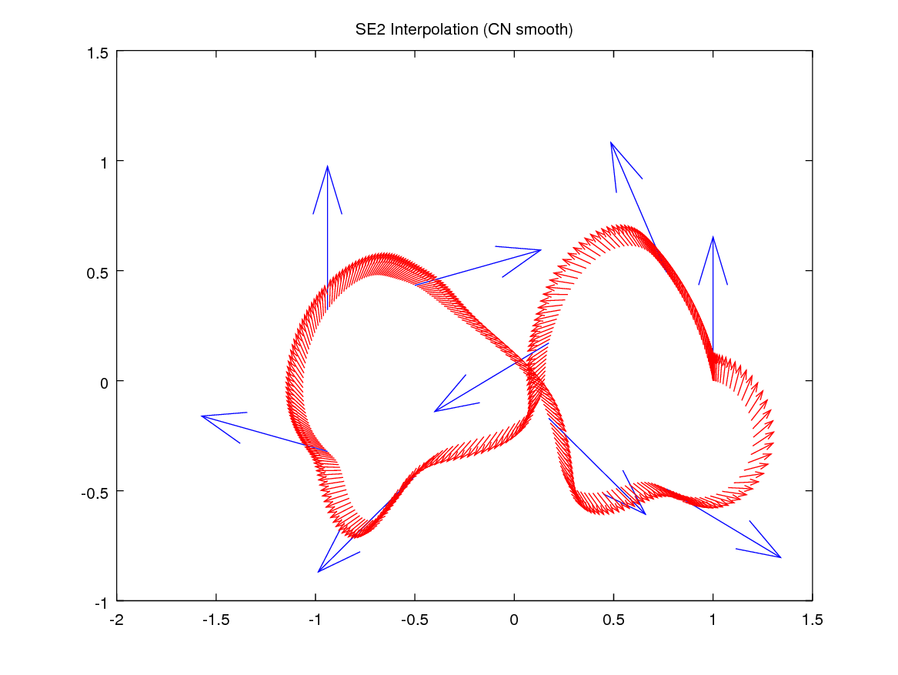

# Interpolation with manif

`manif` provides three interpolation algorithms located in [`algorithms/interpolation.h`](../include/manif/algorithms/interpolation.h).
They are:

1. Slerp interpolation
2. Cubic interpolation
3. CN-smooth interpolation

A brief usage example is shown in [`examples/se2_interpolation.cpp`](../examples/se2_interpolation.cpp).
In this example, `k` points in `SE2` are generated on a 8-shaped curve (large blue arrows).
Between consecutive points, `p` new points are interpolated (in `]0,1[`, smaller red arrows).
The results for each interpolation algorithm is shown in the following figures:





To reproduce the figures:

```terminal
cd manif/build/examples
./se2_interpolation 9 0 40 > se2_interp_slerp.csv
./se2_interpolation 9 1 40 > se2_interp_cubic.csv
./se2_interpolation 9 2 40 > se2_interp_cnsmooth.csv
```

Then open Matlab and edit the visualization script [`examples/scripts/plot_interpolation.m`](../examples/scripts/plot_interpolation.m).
One should edit both the `path` and `file_base` variables.
Run the script to visualize the plot.
