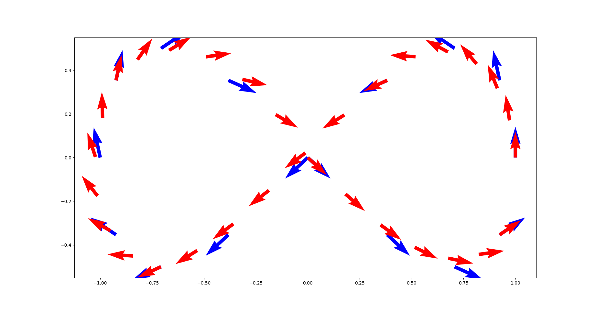
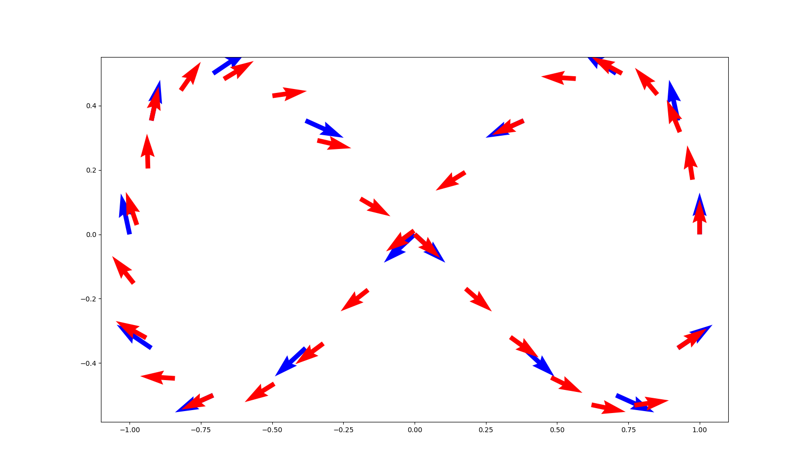

# Splines with manif

`manif` provides two algorithm examples for splines, they are:

- [`algorithms/decasteljau.h`](../../../include/manif/algorithms/decasteljau.h)
- [`algorithms/bezier.h`](../../../include/manif/algorithms/bezier.h)

A brief usage example is shown in [`examples/se2_DeCasteljau.cpp`](../../../examples/se2_DeCasteljau.cpp)
and [`examples/se2_Bezier.cpp`](../../../examples/se2_Bezier.cpp).
In these examples, `k` points in `SE2` are generated on a 8-shaped curve (large blue arrows);
they are the control points.
Depending on the specified curve degree `d`,
the algorithm will create several curves based of `d+1` control points each.
Segments are consecutive forming a splines which knots **are not** smooth.
Finally, for visualization purpose,
the algorithms generate `p` points (smaller red arrows) on the curve for each segment.

The following examples where generated with the following parameters;
16 control points, curves of degree 3 and 6 points per segment,

```bash
./se2_decasteljau 16 3 6
```

```bash
./se2_bezier 16 3 6
```

The points visualization is rendered using the helper script
[`examples/plot_se2_curves.py`](../../../examples/scripts/plot_se2_curves.py)
which generates respectively




To reproduce the figures:

```bash
cd manif/build/examples
./se2_decasteljau 16 3 6 | ../../examples/scripts/plot_se2_curves.py
./se2_bezier 16 3 6 | ../../examples/scripts/plot_se2_curves.py
```
